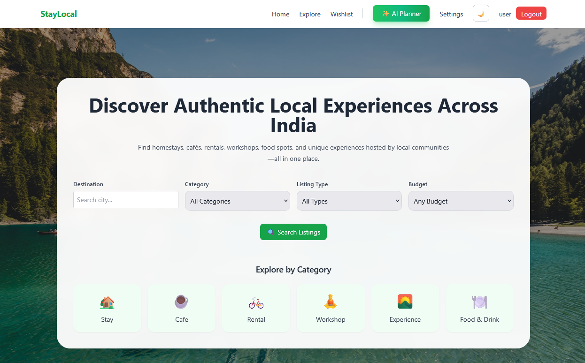
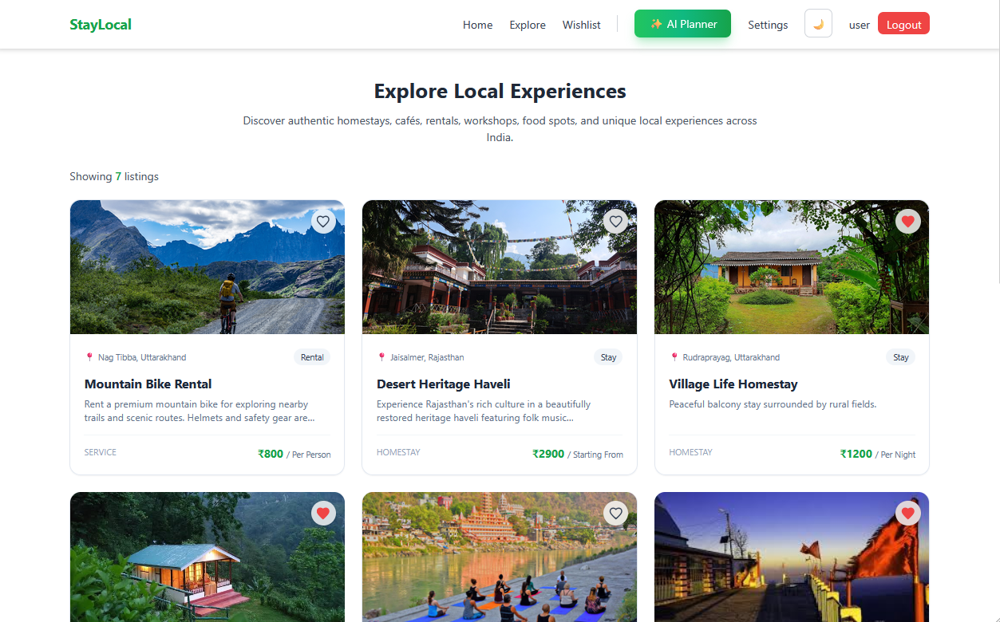
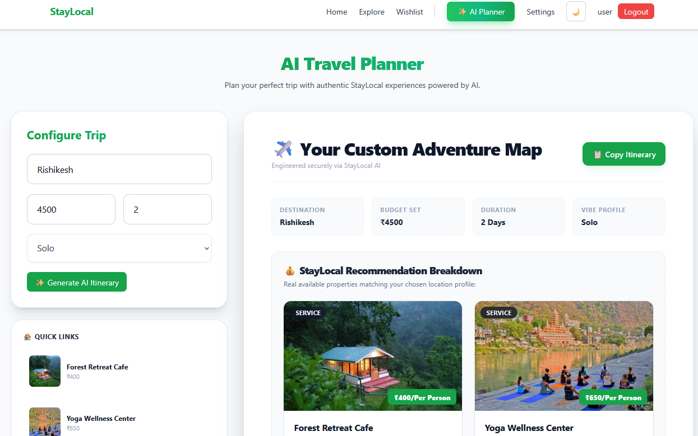

# StayLocal – Connecting Travelers to Local Life
An AI-assisted full-stack web platform connecting travelers with authentic local hosts, stays, activities, and experiences.

---

# 🌐 Live Demo

- **Frontend App:**  https://stay-local-connecting-travelers-to.vercel.app

---

## 📸 Screenshots

### Home Page


### Explore Listings


### AI Travel Planner


### Listing Management


---

## ✨ Key Features

- **Local Discovery & Multi-Way Filtering:** Search and explore homestays, cafés, workshops, local shopping, wellness activities, and regional events. Filter listings by price, or click interactive visual category cards (e.g., *Car Rental*, *Workshop*, *Café*) to instantly apply category filters.
- **City-Based Search:** Search and locate authentic local experiences tailored to specific cities and travel types.
- **AI-Powered Travel Itineraries:** Generate personalized, day-wise travel plans using Google Gemini, tightly integrated with live platform listings.
- **Role-Based Access Control:** Dual dashboards tailored for **Hosts** and **Travelers**.
- **Comprehensive Host Dashboard:** Dedicated portal for hosts to track geographic coverage across locations, review recent listings, and perform full CRUD management (create, edit, update, and delete listings).
- **Wishlist Management:** Save and organize favorite local listings for quick access.
- **Media Uploads:** Native image upload and storage support for listing creation.

---

## 🛠️ Tech Stack

- **Frontend:** React.js, React Router, Tailwind CSS, Vite
- **Backend:** FastAPI, Python, Uvicorn, PyJWT, Passlib
- **Database:** MongoDB Atlas (Cloud NoSQL)
- **AI Integration:** Google Gemini API (`google-generativeai`)
- **Hosting & Deployment:** Vercel (Frontend), Render (Backend)

---

## 🚀 Setup Instructions

Follow these steps to run StayLocal locally on your machine.

### Prerequisites

- Node.js (v18 or later)
- Python (v3.10 or later)
- MongoDB Atlas account (or a local MongoDB server)
- Google Gemini API key

---

### 1. Clone the Repository

```bash
git clone https://github.com/pragatinautiyal/StayLocal-Connecting-Travelers-to-Local-Life.git
cd StayLocal-Connecting-Travelers-to-Local-Life
```

---

### 2. Backend Setup

Navigate to the backend directory and create a virtual environment.

```bash
cd backend

# Create a virtual environment
python -m venv venv

# Activate the virtual environment

# Windows
venv\Scripts\activate

# macOS/Linux
source venv/bin/activate

# Install dependencies
pip install -r requirements.txt
```

#### Environment Variables

Create a `.env` file inside the `backend/` directory and add the following:

```env
MONGO_URI=your_mongodb_connection_string
DATABASE_NAME=staylocal

JWT_SECRET=your_jwt_secret

GOOGLE_CLIENT_ID=your_google_client_id

GEMINI_API_KEY=your_gemini_api_key

ALLOWED_ORIGINS=http://localhost:5173,https://your-frontend-domain.vercel.app

CLOUDINARY_CLOUD_NAME=your_cloudinary_cloud_name
CLOUDINARY_API_KEY=your_cloudinary_api_key
CLOUDINARY_API_SECRET=your_cloudinary_api_secret
```

#### Run the Backend Server

```bash
uvicorn main:app --reload
```

The backend will be available at:

- API: http://127.0.0.1:8000
- Swagger Documentation: http://127.0.0.1:8000/docs

---

### 3. Frontend Setup

Open a new terminal window and navigate to the frontend directory.

```bash
cd frontend

# Install dependencies
npm install
```

#### Environment Variables

Create a `.env` file inside the `frontend/` directory and add the following:

```env
VITE_GOOGLE_CLIENT_ID=your_google_client_id
VITE_API_URL=http://127.0.0.1:8000
```

#### Run the Frontend

```bash
npm run dev
```

The frontend will be be available at:

- Application: `http://localhost:5173`

---

## 📡 API Documentation

| Method | Endpoint | Description |
|---------|----------|-------------|
| GET | `/` | Home Route |
| POST | `/register` | Register User |
| POST | `/login` | Login User |
| POST | `/auth/google` | Google OAuth Login/Register |
| GET | `/api/profile` | Get Current User Profile |
| GET | `/api/dashboard` | Host Dashboard |
| GET | `/api/listings` | Get All Listings |
| GET | `/api/listings/{id}` | Get Single Listing |
| GET | `/api/listings/search` | Search Listings by City |
| GET | `/api/my-listings` | Get Listings Created by Current Host |
| POST | `/api/listings` | Create Listing |
| PUT | `/api/listings/{id}` | Update Listing |
| DELETE | `/api/listings/{id}` | Delete Listing |
| GET | `/api/wishlist` | Get User Wishlist |
| POST | `/api/wishlist/{listing_id}` | Add Listing to Wishlist |
| DELETE | `/api/wishlist/{listing_id}` | Remove Listing from Wishlist |
| POST | `/api/ai-planner` | Generate AI-Powered Travel Itinerary |

---

### Example: User Login

**Request**

```json
{
  "email": "user@example.com",
  "password": "password123"
}
```

**Response**

```json
{
  "access_token": "your_jwt_token",
  "token_type": "bearer"
}
```

---

### Example: AI Travel Planner

**Request**

```json
{
  "destination": "Rishikesh",
  "budget": "Medium",
  "days": 3,
  "travel_type": "Friends"
}
```

**Response**

```json
{
  "itinerary": "Day-wise personalized travel plan generated successfully."
}
```

---

## 🏗️ Architecture & Folder Structure

StayLocal follows a decoupled client-server architecture.

- **Frontend:** Built with React.js and Vite, responsible for rendering the user interface, handling user interactions, and communicating with the backend through REST APIs.
- **Backend:** Built with FastAPI, responsible for authentication, authorization, business logic, AI integration, and CRUD operations.
- **Database:** MongoDB Atlas stores user accounts, listings, and wishlist data.
- **AI:** Google Gemini API generates personalized travel itineraries based on user preferences and available StayLocal listings.


```text
StayLocal/
│
├── backend/
│   ├── services/
│   │   └── ai_service.py
│   ├── uploads/
│   ├── auth.py
│   ├── database.py
│   ├── limiter.py
│   ├── main.py
│   ├── models.py
│   ├── security.py
│   └── requirements.txt
│
├── frontend/
│   ├── public/
│   ├── src/
│   │   ├── api/
│   │   ├── assets/
│   │   ├── components/
│   │   ├── context/
│   │   ├── pages/
│   │   ├── App.jsx
│   │   └── main.jsx
│   ├── package.json
│   └── vite.config.js
│
└── README.md
```

---

## ⚠️ Known Limitations

- **Free-Tier Cold Starts:** The backend is hosted on Render's free tier and may take 30–60 seconds to respond after periods of inactivity.
- **AI Response Time:** AI itinerary generation depends on Google Gemini API availability and may occasionally experience increased response times.
- **Limited Search Functionality:** Listings can currently be searched by city. Advanced filters such as price range, category, ratings, and location radius are planned for future releases.
- **Future Features:** Online booking, payment gateway integration, user reviews, ratings, and in-app messaging are not yet implemented.

---

## 🤝 Credits & Acknowledgements

This project was developed as part of the **AI-Assisted Full Stack Web Development Internship** at **Technology Business Incubator (TBI), Graphic Era University**.

Special thanks to:

- **Google Gemini API** for AI-powered travel itinerary generation.
- **MongoDB Atlas** for cloud database services.
- **Render** for backend hosting.
- **Vercel** for frontend deployment.
- **Cloudinary** for cloud-based image storage and management.
- **React**, **FastAPI**, **Tailwind CSS**, **PyMongo**, **Uvicorn**, and other open-source libraries used throughout the project.


